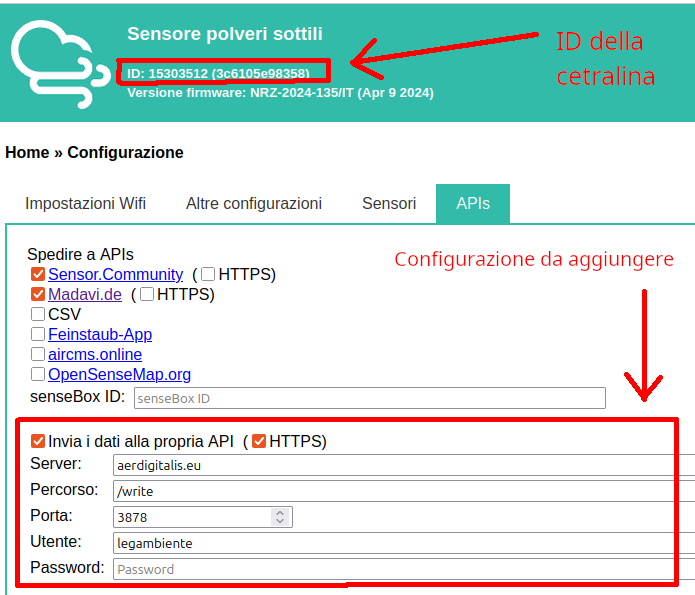

# Come configurare una centralina

Per registrare i dati in tempo reale sul sito [aerdigitalis.eu](https://aerdigitalis.eu:3000/d/ee30edkvuqdc0c/pm2-5-pm10?var-timerange=10m&orgId=1&from=now-2d&to=now&timezone=browse&var-city=$__all&var-hidden_city2chip_id=$__all&var-sensor=$__all) va modificata la configurazione della centralina per registrare i valori su `aerdigitalis.eu`.
Se non e' possibile farlo si possono comunque registrare le centraline presenti su Sensor Community ma i dati saranno aggiornati una volta al giorno e non in tempo reale.

## Modificare la configurazione della centralina per registrare i dati anche su aerdigitalis.eu

Salavare e riavviare la centralina dopo la modifica.

Controllare online sul proprio account il chip ID della centralina, di solito corrisponde a `esp8266-` con aggiunto l'ID evidenziato nella immagine sopra.

Salvare il chip della centralina per il punto successivo, sara' esp8266-[numero della centralina] (nell'esempio `esp8266-15303512`).

## Modificare i due file:

- [chips.csv](../../sensorcommunity/dataingester/chips.csv)

    Contiene l'anagrafe dei punti di installazione delle centraline con: latitudine, longitudine, citta', dettagli.
    **Aggiungere una riga per una nuova centralina specificando il chipID della centralina se noto (`esp8266-15303512` sopra) oppure un nome che inizi con `_`, per esempio `_carmignano8`.**
    **Attenzione: usare il chip id reale presente nella configuraizione della centralina!**

    Specificare chip id (chip_id), latitudine (lat), longitudine (lon), citta' (city), informazione aggiuntive (info)

    

- [sensors.csv](../../sensorcommunity/dataingester/sensors.csv)

    Aggiungere una riga per ogni sensore della centraline in questo file **con lo stesso chip ID del file preedente (per esempio `_carmignano8`), aggiungendo l'id del sensore (per esempio `63300`) che appare in SensorCommunity e il tipo di sensore (per esempio `SDS011`).**

    

Se la configurazione della centralina e' stata fatta correttamente nell'arco di 5 minuti si vedranno i dati della centralina apparire su [aerdigitalis.eu](https://aerdigitalis.eu:3000/d/ee30edkvuqdc0c/pm2-5-pm10?var-timerange=10m&orgId=1&from=now-2d&to=now&timezone=browse&var-city=$__all&var-hidden_city2chip_id=$__all&var-sensor=$__all).
**Ricaricare la pagina del browser per vedere gli aggiornamenti.**
