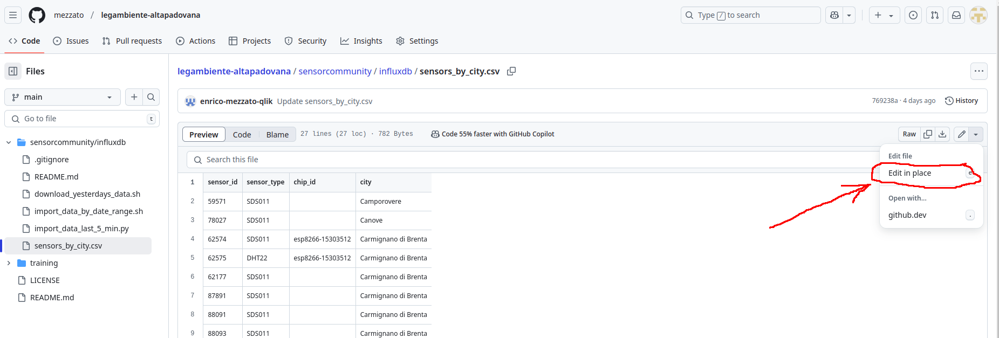
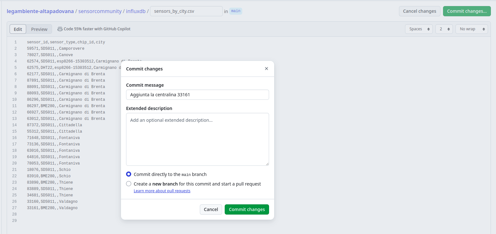
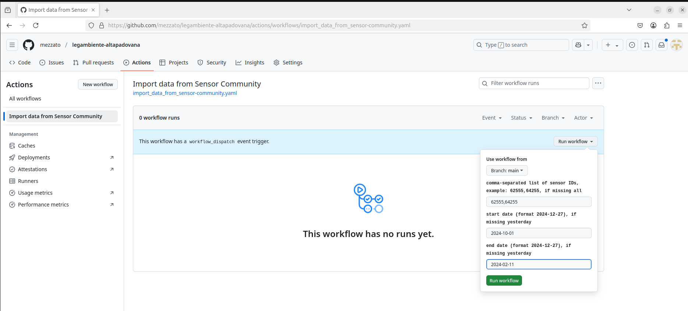
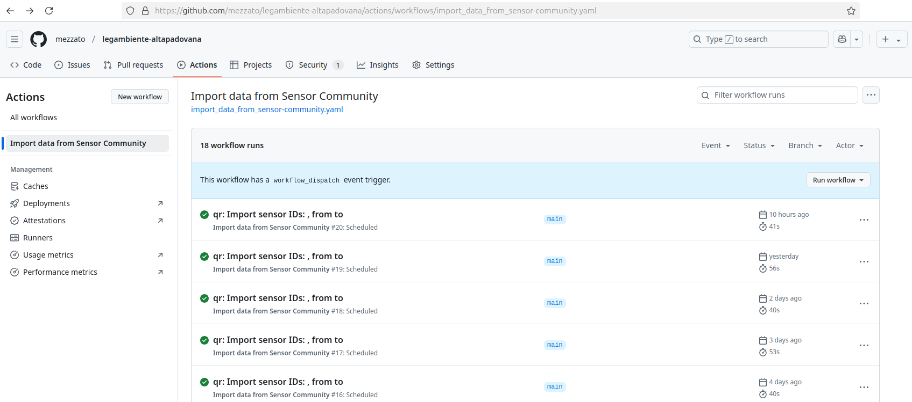

# Introduzione al software di monitoraggio delle polveri sottili

Data di aggiornamento: 2025.02.05

## Come mantenere le centraline

Prerequisiti:

- un account su [github](https://github.com/signup?source=login)
- permessi di accesso a: https://github.com/mezzato/legambiente-altapadovana

Il file da editare e' [sensorcommunity/influxdb/sensors_by_city.csv](https://github.com/mezzato/legambiente-altapadovana/blob/main/sensorcommunity/influxdb/sensors_by_city.csv).

- scegliere "edit in place" per modificare il file
  
- modifcare il file csv (comma-separated values)
  **La prima riga sono le intestazioni di colonne e non vanno modificate.**
  **Aggiungere o togliere le righe successive, ogni colonna e' separata da una virgola (,)**
- salvare i cambiamenti
  

## Come importare dati storici dei sensori

**Nota:** Il sito di Sensor Community a volte e' inaccessibile, si puo' controllare lo stato qui: <https://status.sensor.community/>

1. Aprire questa [pagina](https://github.com/mezzato/legambiente-altapadovana/actions/workflows/import_data_from_sensor-community.yaml), che si trova su "actions" ->  "Import data from sensor community".

2. Scegliere "Run workflow" e riempiri le caselle: 
   - lista degli ID dei sensori separata da ","
   - data d'inizio (start date), nel formato 2025-01-30
   - data di fine (end date), nel formato 2025-01-30
   
   

3. Controllare il risultato dell'esecuzione

   

## Dashboard di Grafana

link utili: [documentazione di Grafana su dashboard(inglese)](https://grafana.com/docs/grafana/latest/dashboards/)

1. Come generare, editare, esportare, importare una dashboard
2. Variabili
3. Condividere una dashboard
4. Come usare una visualization di una dashboard in un sito esterno
5. Come settare notifiche

### Dashboard

[Qui la documentazione](https://grafana.com/docs/grafana/latest/dashboards/build-dashboards/create-dashboard/)

Tutti gli esempi si possono fare su [Grafana Sandbox](https://grafana.com/grafana/), qui per [esempio](https://play.grafana.org/dashboards)

1. Come creare una nuova dashboard
1. Come editare, copiare e salvare una dashboard
1. Come esportare una dashboard
1. Come importare una dashboard
1. [Come assegnare permessi ad utenti](https://grafana.com/docs/grafana/latest/administration/roles-and-permissions/#dashboard-permissions)

### Variabili

### Condividere una dashboard

### Come mostrare la visualization in un sito esterno

Per esempio si veda: <https://sites.google.com/view/pm10-fontaniva/home>

### notifiche

