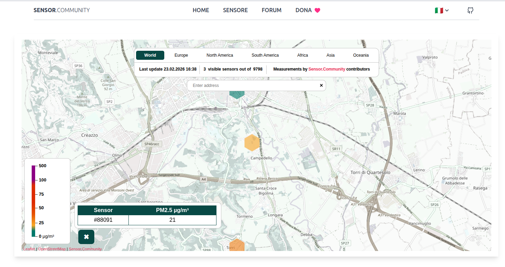
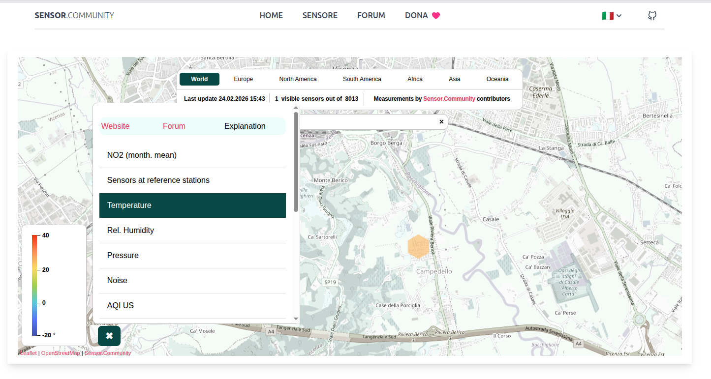
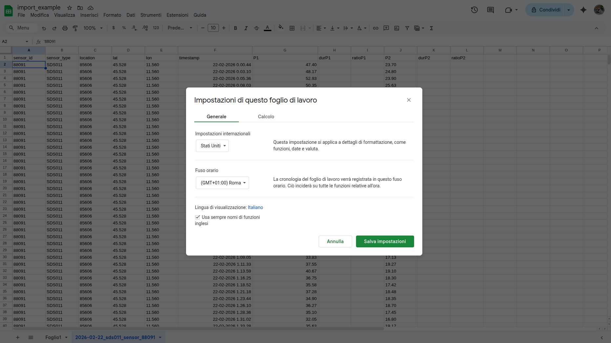
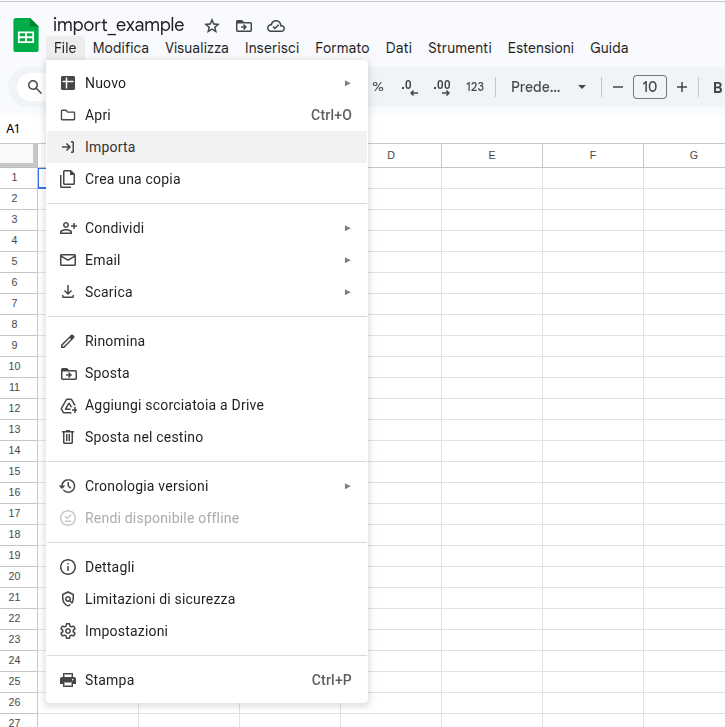
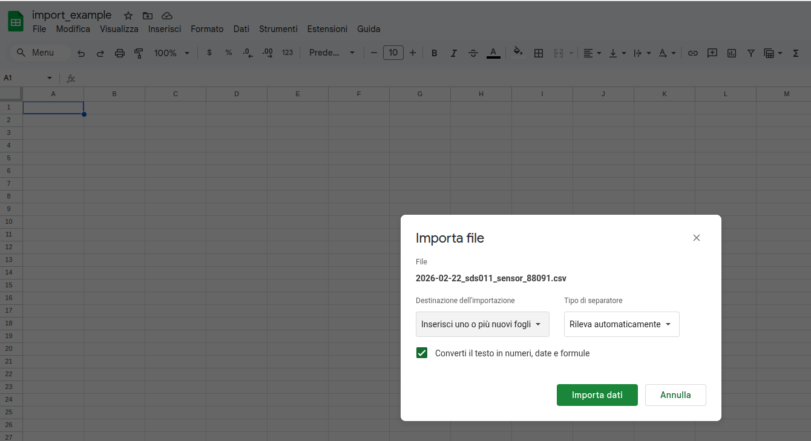
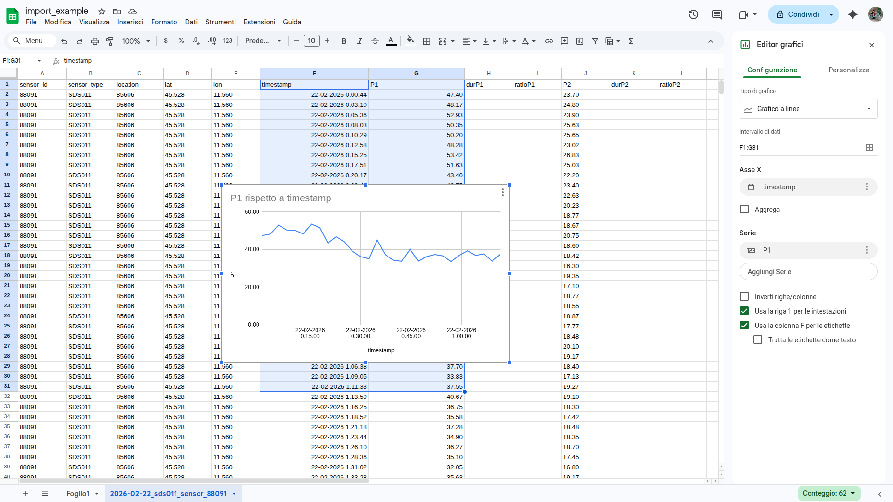
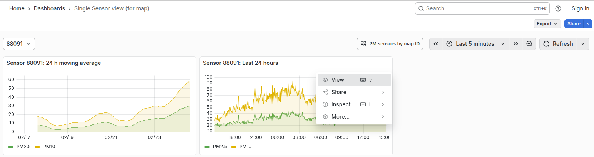
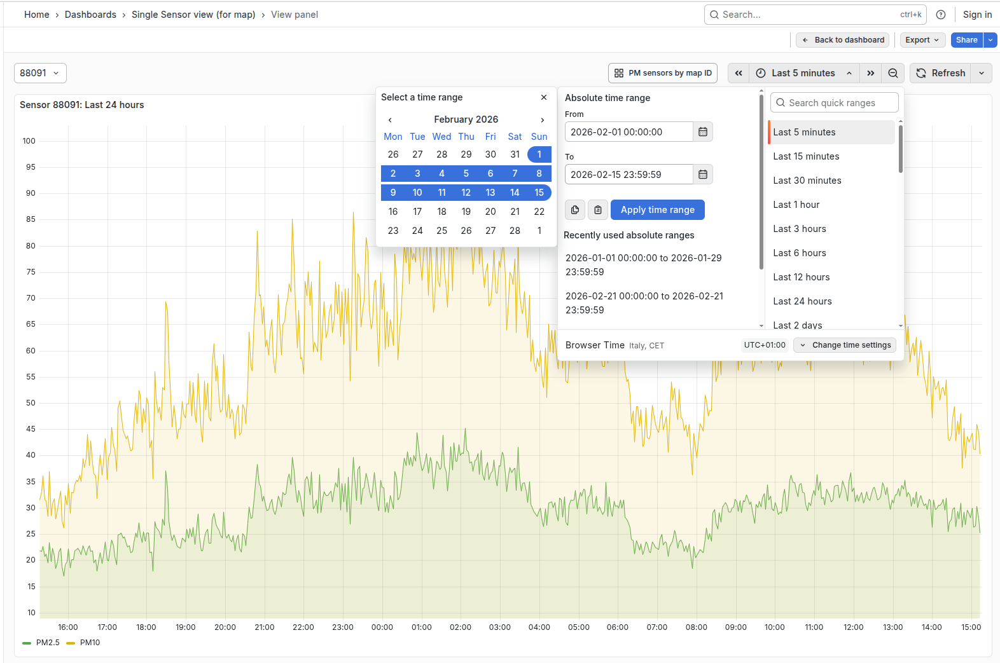
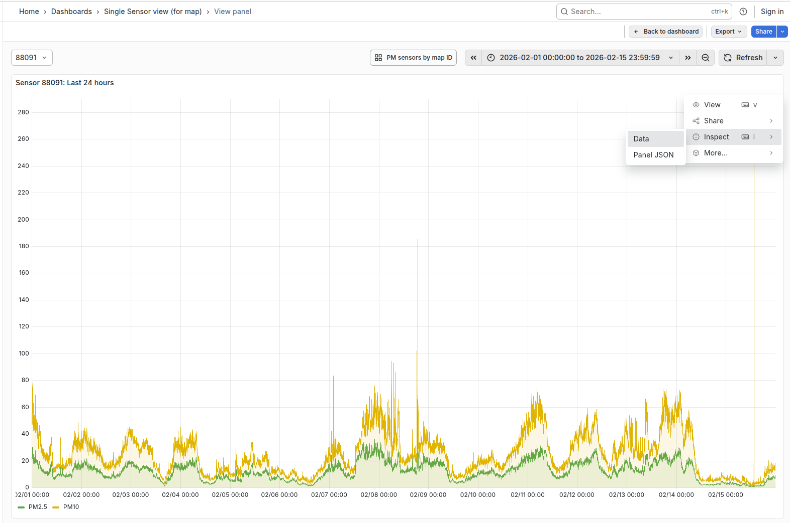
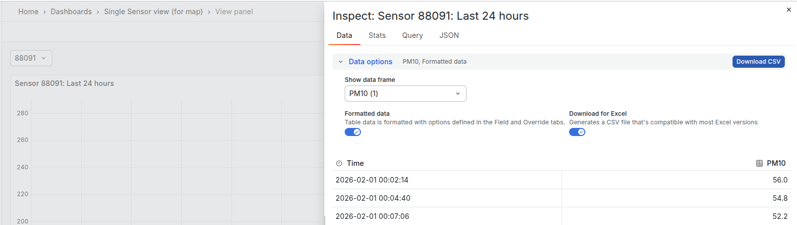

# Come esportare dati delle polveri sottili

## Esportare da Sensor Community come file CSV ed importare in Google Sheets

**Ogni centralina (chip) puo' avere piu' sensori (polveri sottili, temperatura-umidita', pressione)**.
Ogni sensore ha un ID proprio e compare con un ID diverso sulla mappa di Sensor Community.
L'ID della centralina, o chip ID, viene usato per identificare tutti i sensori all'interno della centralina ed e' noto solo a chi la installa.
Anche il chip ID puo' essere usato per scaricare i dati (vedi sotto).

Per l'esportazione serve conoscere l'ID del sensore di polveri sottili della propria centralina, questo si puo' vedere sulla [mappa di Sensor Community](https://sensor.community/it/) (88091 nell'immagine):



**Per la stessa centralina (chip ID) il sensor ID per le polveri sottili e' diverso da quello della pressione e temperature.**
I relativi sensor ID si possono vedere in modo analogo selezionando `Temperature`, `Pressure`, ... cliccando sopra all'ID del sensore (88092 in figura).



### Esportare da Sensor Community come file CSV i dati di un singolo giorno

Scaricare i dati giornalieri dal link: 

```
https://archive.sensor.community/[data in formato dd-mm-yyyy]/[data in formato dd-mm-yyyy]_sds011_sensor_[ID].csv
```

per esempio per il sensore 88091, il giorno 22-02-2026:

```
https://archive.sensor.community/2026-02-22/2026-02-22_sds011_sensor_88091.csv
```

Per vedere tutti i file per tutti i sensori per lo stesso giorno si puo' troncare il link, per esempio:

```
https://archive.sensor.community/2026-02-22/
```

E sulla pagina si puo' cercare il file relativo al sensore voluto (PM, temperature, presssure, etc.). L'esportazione e' analoga ovviamente con campi diversi a seconda del tipo di misura.


I dati sono in formato CSV, per esempio:

```csv
sensor_id;sensor_type;location;lat;lon;timestamp;P1;durP1;ratioP1;P2;durP2;ratioP2
88091;SDS011;85606;45.528;11.560;2026-02-22T00:00:44;47.40;;;23.70;;
88091;SDS011;85606;45.528;11.560;2026-02-22T00:03:10;48.17;;;24.80;;
88091;SDS011;85606;45.528;11.560;2026-02-22T00:05:36;52.93;;;23.90;;
88091;SDS011;85606;45.528;11.560;2026-02-22T00:08:03;50.35;;;25.63;;
88091;SDS011;85606;45.528;11.560;2026-02-22T00:10:29;50.20;;;25.65;;
...
```

I dati rilevanti sono le colonne: timestamp (data), P1 (PM10), P2 (PM2.5).


### Importare i dati in Google Sheets da file CSV

I file CSV usano un formato numerico decimale con ".", come negli US. Quindi e' consigliabile cambiare (temporaneamente) la lingua prima di importare i dati.



Quindi importare i dati:





Per creare un grafico per esempio selezionare l'area dati voluta con i titoli di colonna ed inserire un grafico:



## Esportare dal sito di Grafana di madavi.de (Sensor Community)

Si puo' usare il sito di Grafana di Sensor Community (madavi.de) in due modi:

1. Usando l'ID del sensore come sopra a [questo link](https://api-rrd.madavi.de:3000/grafana/d/000000004/single-sensor-view-for-map?var-chipID=1000&var-type=sds011&var-query0=feinstaub&orgId=1&from=now-5m&to=now&timezone=browser&var-node=88091)

   

   Scegliere `View` per espandere, e usare i dropdown col calendario per selezionare l'intervallo voluto:

   

   Quindi scegliere dal menu `View - Inspect Data`

   

   Poi selezionare `Data` e `Download CSV` con le opzioni attive per `Formatted data`, `Download for Excel`

   

   L'importazione su Google Sheets si puo' fare come sopra.

1. Con l'ID del chip della centralina a [questo link](https://api-rrd.madavi.de:3000/grafana/d/GUaL5aZMA/pm-sensors-by-map-id?orgId=1&from=now-6h&to=now&timezone=browser&var-chipID=1000&var-type=sds011&var-query0=feinstaub) per polveri sottili, e [questo link](https://api-rrd.madavi.de:3000/grafana/d/q87EBfWGk/temperature-humidity-pressure?orgId=1&from=now-6h&to=now&timezone=browser&var-chipID=esp32-12078136) per temperatura, umidita', pressione


## Esportare dal sito di Grafana di Legambiente

Questo metodo permette una ricerca temporale piu' agevole, perche' i dati di Sensor Community possono solo essere esportati giorno per giorno.